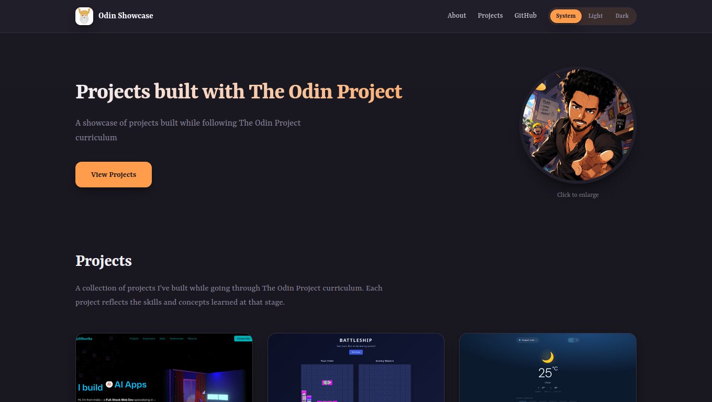

# Odin Showcase

A showcase of projects built while following [The Odin Project](https://www.theodinproject.com) curriculum.

**Live site:** https://Sid2169.github.io/odin-showcase/



Built with React, TypeScript, and Vite.

## Development

```bash
npm install
npm run dev
```

## Deployment

```bash
npm run deploy
```

Builds the site and pushes `dist` to the `gh-pages` branch, which GitHub Pages serves.

## Projects

Project data is defined in `src/constants.ts` (`PROJECTS` array). Add a new project and place its screenshot in `public/assets/projects/`.